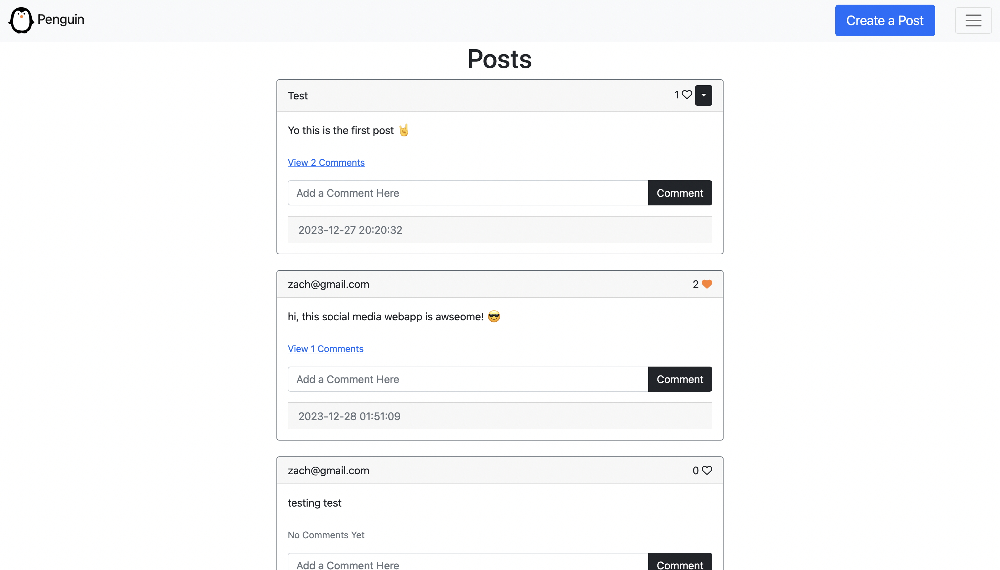
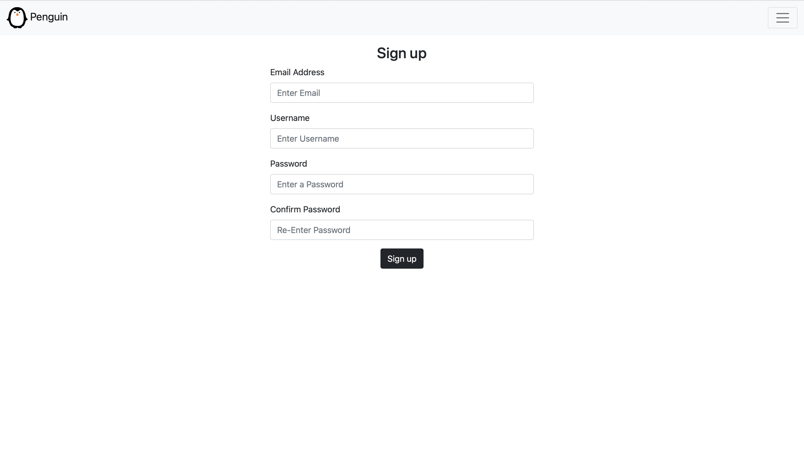
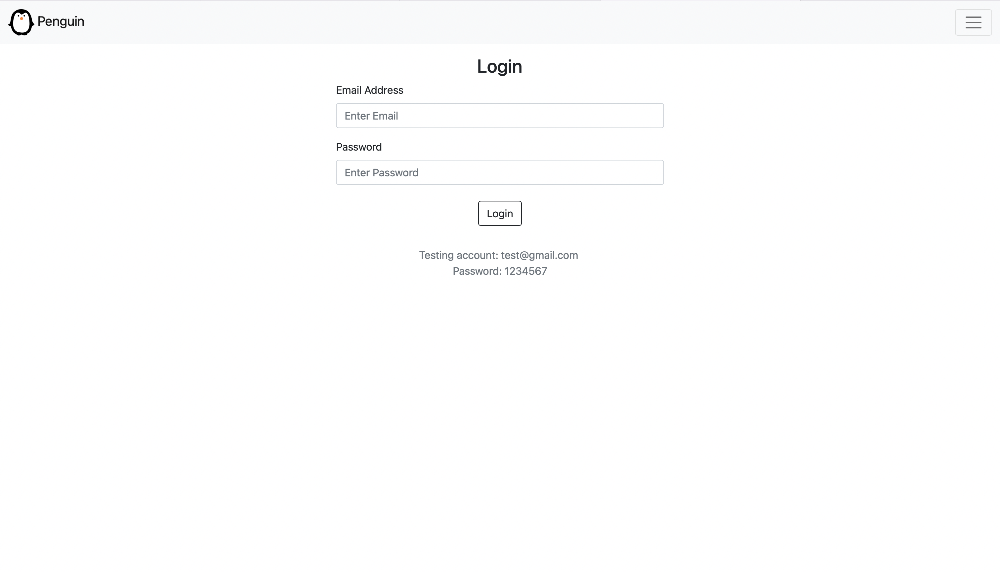

# Penguin
Penguin is a social media web application where you can post your thoughts and write about what interests you.

## How To Run The App
You can use the app on http://zachdjerdjou.pythonanywhere.com/

## How To Get Started
1. Either login using the testing account (Email: test@gmail.com  Password: 1234567) or you can sign up by going in the menu and selecting the sign up page
2. Click on "Create a post" and write up a post
3. Post it and you're done!

## Features
- Creating a post
  - A post gets sent to the backend and gets posted to all users
  - Posts get validated: a post can't be empty
  - Each post has a timestamp

- Creating an account
  - You must create an account to have access to home page and view posts
  - Emails are checked to see if they have not been used for another account (you can't use an email already in use)
  - Passwords are validated and sign up is denied if passwords don't match when confirming passwords
  - A pop-up message is posted to tell you what went wrong with when signing up or if you've successfuly created an account

- Log in
  - After creating an account you can log in to view home page
  - Access is denied if email and/or password is incorrect or doesn't exist
  - A pop-up message will alert you with your mistakes when logging in

- Log out
  - After logging in, you can log out which removes you from the home page

- Liking and unliking a post
    - You can like or unlike by clicking the little heart on the top right of a post (if the heart changes colors than you've liked the post)
    - A like gets sent to the backend and gets posted to all users

- Commenting on a post
  - You can comment on a post by writing comething in the comment section and post it by clicking the "comment button"
  - The comment will be sent to the backend and will be visible to all users
  - You can view comments by clicking the "View comments button" on a post
  - If there aren't any comments, it will be indicated
  - If the comment belongs to your account, an option to delete the comment will appear on the right or your comment
  - Each comment has a timestamp

- Deleting a post
  - If the posts belongs to your account, a dropdown menu will appear on the top right corner of your post, allowing you to delete it
  - Deleting a post completely erases it from the database for all users

## What I Used To Build The Web App
- Python 3
- Flask
- SQLAlchemy
- SQLite
- HTML
- CSS

## What The App Looks Like

